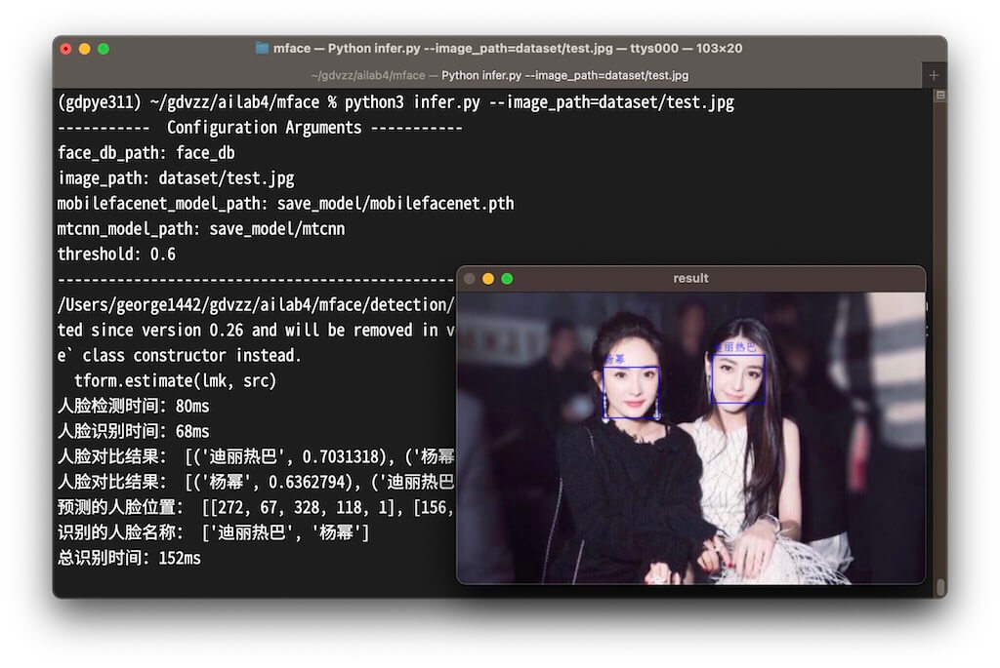

# 人脸识别项目（未完待续）

`更新-260316` \| `发布-260316`

从一个想法到实现的过程，供参考。

## 想法

想做一个人脸识别项目，识别摄像头拍到的人脸是张三还是李四。项目做出来后可用于：

- **刷脸开门**：待项目逐步成熟后，替代当前部分房间的密码开门、钥匙开门。能力要持平商业产品，价格要有竞争力。
- **刷脸打卡**：会议等签到可使用刷脸来打卡。
- ……（更多用途待畅想）

## 思考如何实现

真的能做到**刷脸开门**、**刷脸打卡**等，肯定还有很多功能要做的。比如要接喇叭说：你好！张三。核心功能还是：有个人脸库（存放若干人脸照片），和待识别图片比对，从而识别出是张三李四。

当前约定在华为开发板[^1] 上实现。可能当前阶段还用不到 vibe coding 相关工具比如 Claude Code。先问问 deepseek 和 豆包，比如：

```markdown
人脸识别系统

1、基于昇腾 200I DK A2 开发板。
2、请推荐人脸识别模型，小型、轻量即可。
3、将模型转换成开发板要求的 om 模型，由我用 ATC 工具来做。
4、识别最多10张不同的脸。
5、用 Python 实现。
6、要使用开发板的 ACL 语言，以便使用开发板的 NPU 算力做推理

请给出样例代码。
```

AI 给了 3 个模型：

- SCRFD，人脸检测
- VanillaCNN，关键点对齐
- SphereFace，特征提取

在开发板上执行给的代码，也不大对。

继续和AI交流，比如用一个模型，……。AI推荐 MobileFaceNet。在上网搜索，得到一个开源项目：[夜雨飘零/Pytorch-MobileFaceNet↗]。

## 体验人脸识别

[夜雨飘零/Pytorch-MobileFaceNet↗] 貌似可以直接运行。

在 macOS 笔记本上启动 **终端**，新建空目录，在空目录中执行 git clone 下载源码：

```bash
mkdir ailab
cd ailab
git clone git@gitee.com:yeyupiaoling/Pytorch-MobileFaceNet.git
```

主要做了一下工作，可在 macOS 笔记本上跑通：

- 激活笔记本上的 Python 虚拟环境，尝试运行，并安装缺少的 Python 包。

- 修改 GPU 相关为 CPU。和 AI 交流后得到的主要修改有：

    ```python
# self.device = torch.device("cuda")
self.device = torch.device("cpu")
...
# self.model = torch.jit.load(mobilefacenet_model_path)
self.model = torch.jit.load(
    mobilefacenet_model_path, map_location=torch.device("cpu")
)
    ```

    > 有多处类似地方，要做相应修改。

执行以下命令得到推理结果：

```bash
python3 infer.py --image_path=dataset/test.jpg
```



<!--  -->

[夜雨飘零/Pytorch-MobileFaceNet↗]: https://gitee.com/yeyupiaoling/Pytorch-MobileFaceNet

<!--  -->

[^1]: [华为开发者套件简介](../ug/huawei-dk-200idka2.md)


