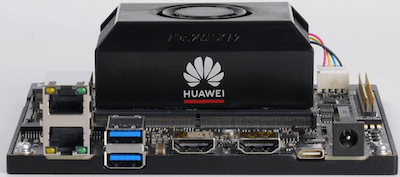

# 华为开发者套件简要说明

`更新-260314` \| `发布-260312`

## 开发者套件简介

Atlas 200I DK A2 开发者套件（以下简称开发者套件）是一款高性能的AI开发者套件，可提供8TOPS INT8的计算能力，可以实现图像、视频等多种数据分析与推理计算，可广泛用于教育、机器人、无人机等场景。产品主要规格如下：

**处理器：** 1个NPU + 4个CPU

- 1个NPU：DaVinciV300 AI core（主频500MHz）
- 4个CPU：TAISHANV200M处理器核（主频1.0GHz）

**AI算力：** 4 TFLOPS

- 半精度（FP16）：4 TFLOPS
- 整数精度（INT8）：8 TOPS

**内存：** 4GB

开发者套件就是不带显示器、不带键盘鼠标、没有机箱、有AI算力的小计算机。外观如下：




更多信息和文档请参考：

- [文档-Atlas 200I DK A2开发者套件↗](https://www.hiascend.com/document/detail/zh/Atlas200IDKA2DeveloperKit/23.0.RC2/index/index.html)
- [开发者套件主页↗](https://www.hiascend.com/hardware/developer-kit-a2)

---

## SSH登录开发板

本章节参考官网 [快速开始↗](https://www.hiascend.com/document/detail/zh/Atlas200IDKA2DeveloperKit/23.0.RC2/qs) ，描述如何登录开发板。

初次使用开发者套件的用户可以参见如下步骤完成开发者套件的启动使用：

- **准备硬件。** 准备烧录镜像和登录开发者套件进行推理业务的配件，如PC、SD卡、读卡器、数据线等。
- **制卡。** 将包含OS、CANN软件的镜像烧录到SD卡，用于启动运行开发者套件。
- **连接启动开发者套件。** 将烧录镜像后的SD卡插入开发者套件，上电运行开发者套件。
- **登录开发者套件。** 通过本机显示或者远程登录的方式登录开发者套件，即可在开发者套件运行推理业务。

可外借的开发者套件，已经烧录好镜像，插上电源 + 连接网线就可以 SSH [^1] 登录开发板。如想尝试重新烧录 SD 卡的同学，可参考官网 [准备硬件↗](https://www.hiascend.com/document/detail/zh/Atlas200IDKA2DeveloperKit/23.0.RC2/qs/qs_0001.html) 和 [Windows系统制卡↗](https://www.hiascend.com/document/detail/zh/Atlas200IDKA2DeveloperKit/23.0.RC2/qs/qs_0005.html)。读卡器等可联系老师借用。

有几种登录方式：

- 本机显示模式。开发板连接USB键盘、USB鼠标，接上HDMI显示器，插上电源后开机启动，如同 Linux 计算机那样使用。
- 远程登录模式。用 网线 或 Type-C 线，连接开发板和本地电脑（笔记本或台式机），在本地电脑运行 ssh 用户名@开发板IP地址 登录开发板，然后命令行方式（不是图形界面方式）使用开发板。

开发板的IP地址：

- 在烧录制卡的过程中，“配置网络信息”步骤可以修改开发板的IP地址。如果不修改网络信息，则镜像烧录完成后，开发者套件eth1网口默认静态IP地址为192.168.137.100（**上下排列的2个网口的上面那个**）；eth0网口为DHCP动态模式，未分配IP地址；Type-C接口默认静态IP地址为192.168.0.2。
- 开发者套件3个接口的IP地址不能为同一网段，以255.255.255.0子网掩码为例，IP地址的前3段不能相同，例如Type-C接口IP为192.168.0.2，那么eth1网口和eth0网口不能配置为192.168.0.x。

以下简介如何网线连接开发板，并通过 SSH 登录开发板。

### Step1-开发板接通电源

主要有以下步骤：

- 将SD卡插入开发者套件的SD插槽，并确保完全推入插槽底部。（注：外借的开发板已插入SD卡。可跳过该步骤。）

- 请确保开发者套件的拨码开关2、3、4（开关1为预留开关，当前无功能）的开关值为：2-OFF，3-ON，4-OFF。如果不是则要调整，否则将无法从SD读取镜像启动开发者套件。（注：外借的开发板已在正确位置。可跳过该步骤。）

---

## 1、SSH登录开发板

### 1.1 将烧录好的 SD 卡插入开发板，并上电

- 断电状态下（即开发板没有通电源），插入已经烧录好的 SD 卡。如何烧录，可参考官网相关链接，此处从略。
- 插上电源后，开发板上的三个绿灯，会逐个点亮。稍等一会后，三个绿灯都亮了，则表示启动成功。

### 1.2 用网线连接电脑和开发板，并设置电脑的 IP 地址

用网线连接电脑和开发板：

-  （可选）电脑如果没有空闲网口，可在电脑 USB 上插 USB转网口 的转接器，以获得一个空闲网口。
-  网线一端，插入电脑的空闲网口。
-  网线另一端，插入开发板的网口。开发板有 2 个网口，上下排列，要插入上面那个网口。

把电脑的 IP 地址，设置为和开发板同一个网段的地址。打开：设置 \| 网络。找到 网口（或 USB 网口）对应的网络适配器，修改 IP 地址的相关设置。

- 设置 [DHCP]：手动
- 设置 [IPV4]：ON
- 设置 [IP]：192.168.137.xxx。 xxx 取值说明如下：
    ```txt
    0：不可用，因为 0 是网络号。
    1 ~ 99：可用。比如，可以将电脑的 IP 地址设置为 192.168.137.99。
    100：不可用，因为被开发板占用了。
    101 ~ 254：可用。比如，可以将电脑的 IP 地址设置为 192.168.137.200。
    255：不可用，因为 255 是广播地址。
    ```
- 设置 [子网掩码]。设置长度或掩码，视操作系统版本不同而不同。
    ```bash
    设置 [子网掩码长度]： 24
    或者 [子网掩码]： 255.255.255.0
    ```
- 设置 [网关]。
    ```markdown
    视操作系统版本不同而不同。有的要求设置，否则无法保存。
    如要求设置，可填写 192.168.137.xxx。xxx在上述可选的范围内，且和本机设置的 IP 不同。
    ```
- 点击 [保存]

### 1.3 测试电脑和开发板之间网络是否连通

在电脑上启动命令行终端程序（比如 Windows 操作系统的 cmd，或者 powershell），并在命令行终端上执行 `ping 192.168.137.100`。如能看到如下信息，则表明电脑和开发板之间的网络是连通的。

```bash
~ % ping 192.168.137.100
PING 192.168.137.100 (192.168.137.100): 56 data bytes
64 bytes from 192.168.137.100: icmp_seq=0 ttl=64 time=0.450 ms
64 bytes from 192.168.137.100: icmp_seq=1 ttl=64 time=0.701 ms
......              
```

> 说明：192.168.137.100 是开发板 IP 地址，当网线插入开发板上下排列的2个网口的上面那个网口时。
 
### 1.4 SSH 登录开发板

在电脑的命令行终端中执行如下命令登录开发板：

```bash
ssh root@192.168.137.100
```
屏幕提示 `root@192.168.137.100's password:` 时，输入密码 `Mind@123`。输入密码完成后按回车键。✅ **密码输入过程中，屏幕不会有显示（因为是密码，所以不能显示出来），这是正常的，不必担心。**

当输入正确密码后，就可以登录开发板，并看到如下信息。

```bash
~ % ssh root@192.168.137.100
root@192.168.137.100's password: 
......
(base) root@davinci-mini:~#                 
```

> 也可以通过开发板的 HwHiAiUser 账号登录开发板。命令是 `ssh root@192.168.137.100`，初始密码也是 `Mind@123`。

---

## 2、运行开发板的预置样例

### 2.1 启动开发板的预置样例

参考 [1、SSH登录开发板](#1ssh登录开发板)，用开发板的 root 账号（或者 HwHiAiUser 账号），ssh 方式登录开发板。

1. 在本地电脑执行以下 ssh 命令登录开发板：

   ```bash
   ssh root@192.168.137.100
   ```

   > root 和 HwHiAiUser 账号的初始密码都是 `Mind@123`。

2. 登录后执行以下 `cd` 命令切换到样例目录：

    ```bash
    cd /home/HwHiAiUser/samples/notebooks
    ```
3. 执行以下命令启动 jupyter lab：

   ```bash
   jupyter lab --ip 192.168.137.100 --allow-root --no-browser
   ```

   > 该目录下的 `start_notebook.sh` 中就是上述命令。

   可看到如下信息，表示开发板预置样例启动了。

    ```bash
    ......
    To access the server, open this file in a browser:
    file:///home/HwHiAiUser/.local/share/jupyter/runtime/jpserver-38492-open.html
    Or copy and paste one of these URLs:
    http://192.168.137.100:8888/lab?token=696173ee0cbed331a0e360bf5a2b851cdf81dde0850fce7d
    http://127.0.0.1:8888/lab?token=696173ee0cbed331a0e360bf5a2b851cdf81dde0850fce7d
    ```   

4. 复制上述链接，在本地电脑的浏览器打开，就可以看到样例        

    - 将 http://192.168.137.100:8888/lab?token=696173ee0cbed331a0e360bf5a2b851cdf81dde0850fce7d 那行，复制到本地电脑的浏览器中。（token后面的取值，会每次不一样，不要复制此处的样例）
    - 不是复制 http://127.0.0.1:8888 那行。127.0.0.1 表示本机，本地电脑并没有启动什么样例的服务端。192.168.137.100（开发板）上，才是启动了样例的服务端。

5. 运行第1个样例
<!-- 界面样例截图如下：
image-functions -->


### 运行所有样例
运行所有样例，并能理解样例原理。

如何使用预置样例，请参考昇腾官网-体验预置样例

### 相关任务
任务#1：完成其他物体或人物的图片识别

相关步骤建议如下：

拍摄，或从网上搜索可用的图片。
从本地电脑上传到开发板相应目录。可使用相关软件上传，或在命令行终端中执行 scp 命令上传。scp 命令使用方法可自行查找。
修改相关样例程序（如需要）。
执行/调试修改后的样例程序，并得到预期结果。
截图。截图包括：本机 IP 地址 + 运行结果。

任务#2：完成其他物体或人物的视频识别

相关步骤建议如下：

拍摄，或从网上搜索可用的视频。
从本地电脑上传到开发板相应目录。可使用相关软件上传，或在命令行终端中执行 scp 命令上传。scp 命令使用方法可自行查找。
修改相关样例程序（如需要）。
执行/调试修改后的样例程序，并得到预期结果。
截图。截图包括：本机 IP 地址 + 运行结果。

任务#3：通过摄像头完成物体或人物的识别

相关步骤建议如下：

安装摄像头到开发板。相关指导可参考对接USB摄像头
修改相关样例程序（如需要）。
执行/调试修改后的样例程序，并得到预期结果。
截图。截图包括：本机 IP 地址 + 运行结果。
提示：因权限要求，需要用 root 用户启动/运行样例程序。

关机
1、电源插头的附近，有3个小按钮。长按中间那个按钮，约几秒钟后松开，稍后等待3个绿灯逐个熄灭，剩余一个绿灯亮时，就可以拔掉电源了。

2、或者，切换到 root 用户关机，执行以下命令：
su root
shutdown -h now
也是要等一个绿灯亮时，才可以拔掉电源了。root 用户口令是 Mind@123

(base) HwHiAiUser@davinci-mini:~/samples/notebooks$ su root
Password: 
(base) root@davinci-mini:/home/HwHiAiUser/samples/notebooks# shutdown -h now
Connection to 192.168.137.100 closed by remote host.
Connection to 192.168.137.100 closed.

附录
昇腾官网相关链接
- 昇腾开发板（Atlas 200I DK A2） 简介
- 昇腾开发板快速开始

VSCode 连接开发板
VSCode 可下载插件 Remote-SSH 连接开发板。这样就可以通过本地电脑的 VSCode，直接编辑开发板上的文件了。
参考指导：vscode通过ssh连接服务器实现免密登录+删除（吐血总结）
上述指导中的“二、设置免密登录”，可以不做。不做的话，就是要经常输入账号对应的密码。

<!--  -->

[^1]: [什么是SSH？↗](https://info.support.huawei.com/info-finder/encyclopedia/zh/SSH.html)，华为，IP知识百科，2025-07-08